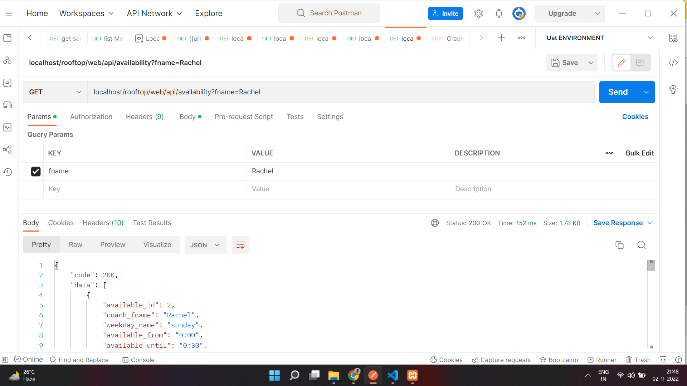

<p align="center">
    <a href="https://github.com/yiisoft" target="_blank">
        
    </a>
    <h1 align="center">Rooftop project</h1>
    <br>
</p>


DIRECTORY STRUCTURE
-------------------

      assets/             contains assets definition
      commands/           contains console commands (controllers)
      config/             contains application configurations
      controllers/        contains Web controller classes
      mail/               contains view files for e-mails
      models/             contains model classes
      runtime/            contains files generated during runtime
      tests/              contains various tests for the basic application
      vendor/             contains dependent 3rd-party packages
      views/              contains view files for the Web application
      web/                contains the entry script and Web resources
      module/             contains api controller


REQUIREMENTS
------------

The minimum requirement by this project template that your Web server supports PHP 7.4.


INSTALLATION
------------

### Install via Composer

If you do not have [Composer](http://getcomposer.org/), you may install it by following the instructions
at [getcomposer.org](http://getcomposer.org/doc/00-intro.md#installation-nix).


### Database

Edit the file `config/db.php` with real data, for example:

```php
return [
    'class' => 'yii\db\Connection',
    'dsn' => 'mysql:host=localhost;dbname=rooftop',
    'username' => 'root',
    'password' => '1234',
    'charset' => 'utf8',
];

 ### API DOCUMENT
  can be found in url https://documenter.getpostman.com/view/3378051/2s8YRpEW9P
  
  
  some screenshot for api returns
  
  
  
 
 
 
 
 
 
 
 
 
  


